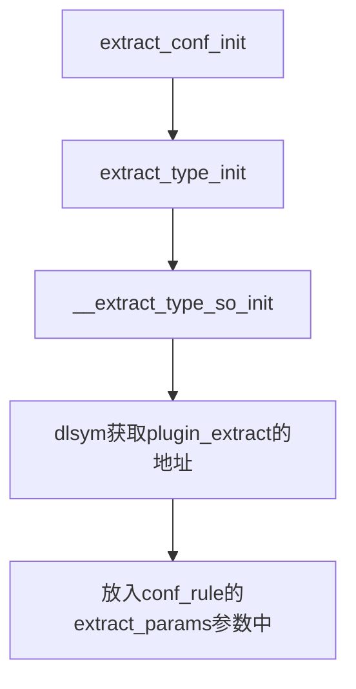
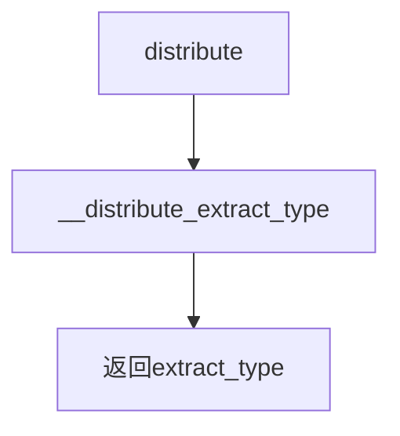
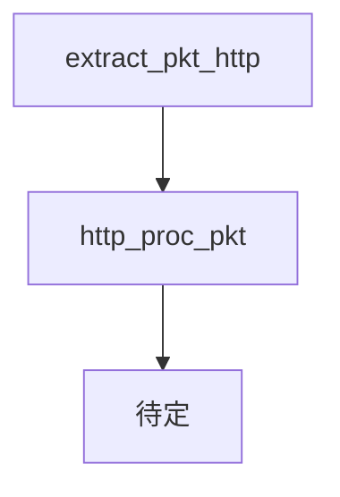

```mermaid
graph TD;
   extract_conf_init-->extract_type_init;
   extract_type_init -->__extract_type_so_init;
   __extract_type_so_init --> dlsym获取plugin_extract的地址;
   dlsym获取plugin_extract的地址 --> 放入conf_rule的extract_params参数中
```

```mermaid
graph TD;
	distribute -->__distribute_extract_type
	__distribute_extract_type --> 返回extract_type
```

```mermaid
graph TD
extract_pkt_http-->http_proc_pkt
http_proc_pkt-->待定
```

